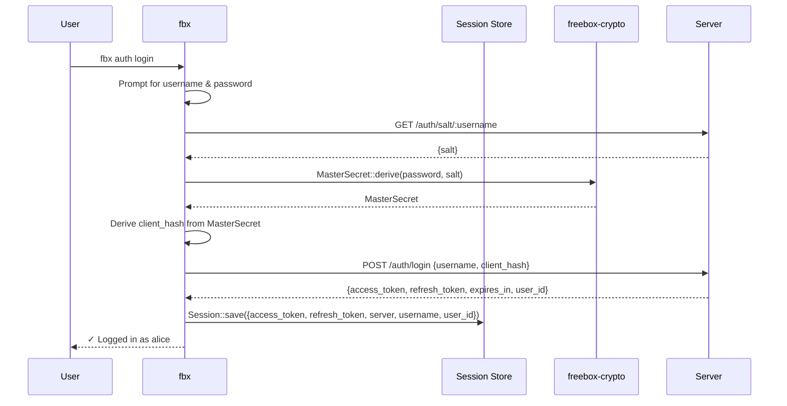
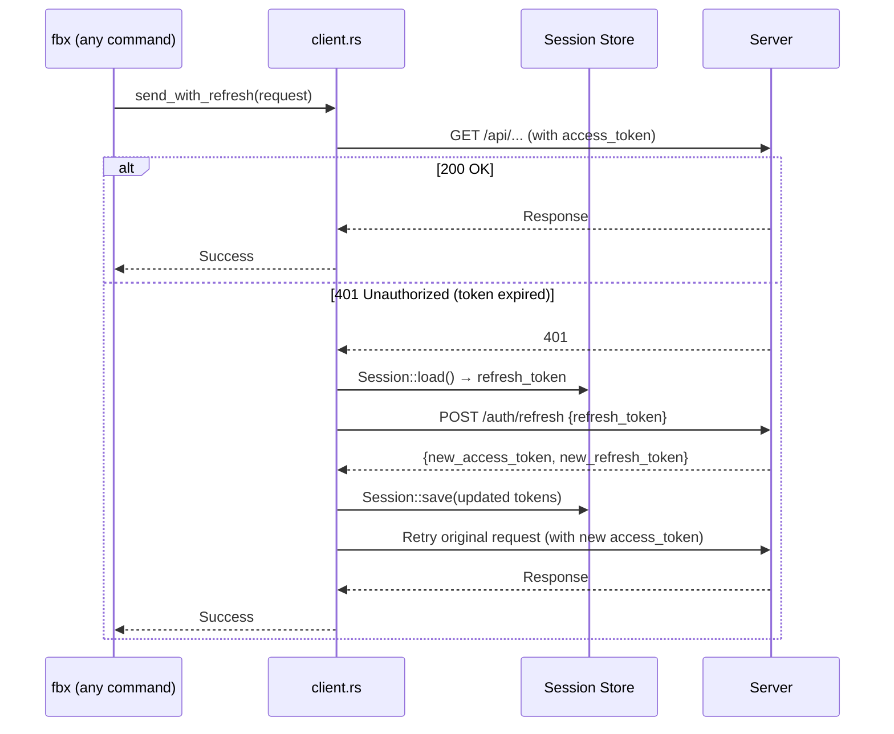
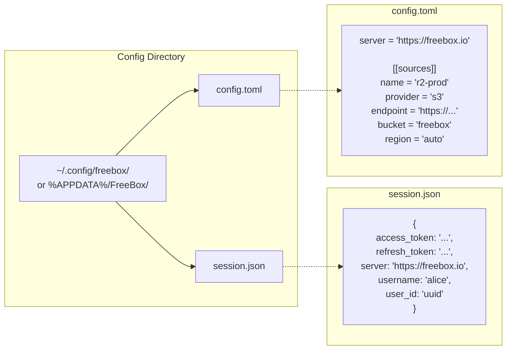
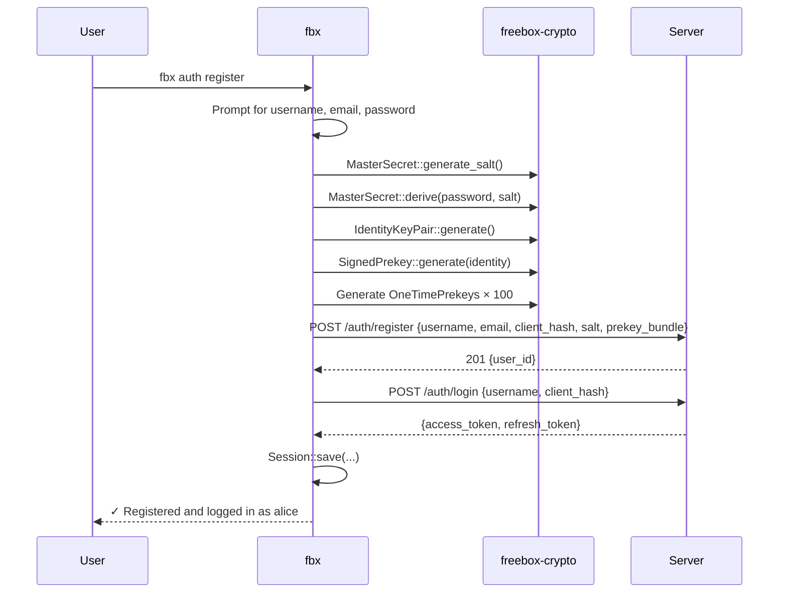

# CLI Auth Flow

> Last synced: 2026-05-11

Login, token refresh, and session persistence in `apps/cli`.

## Login & Session Persistence

## Automatic Token Refresh

## Session File Layout

## Registration Flow

