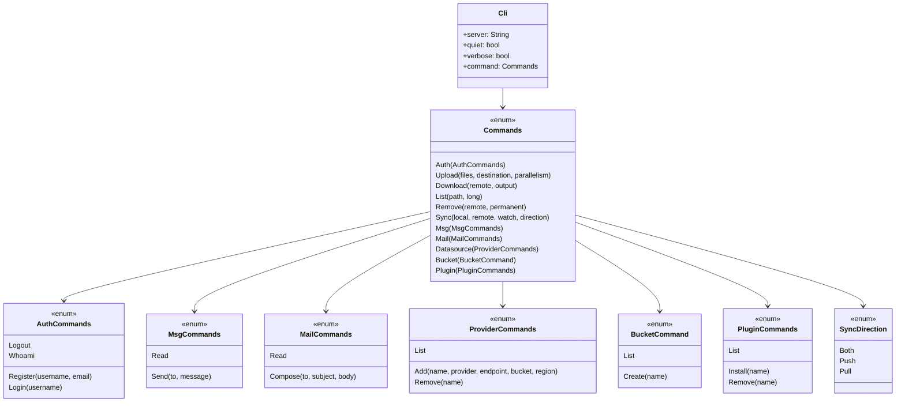
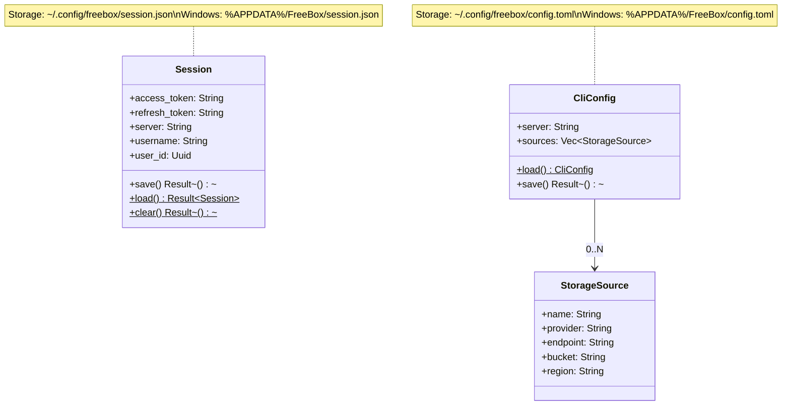
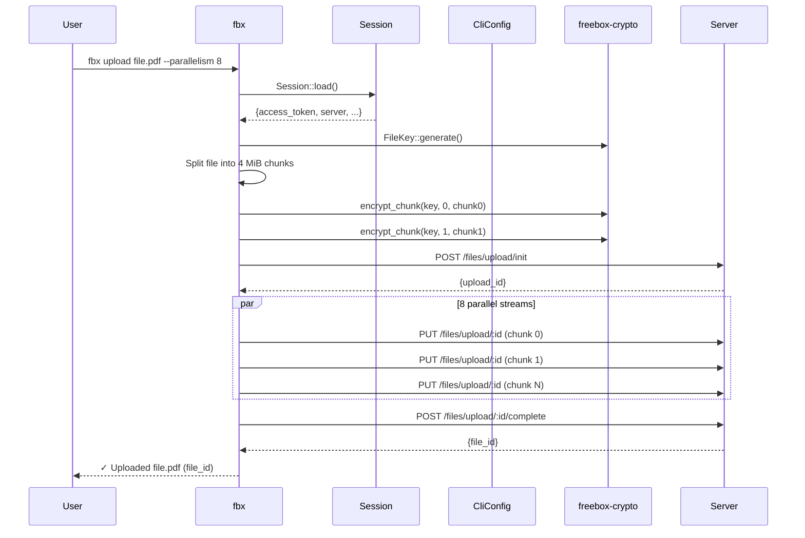

# CLI Commands

> Last synced: 2026-05-11

Class diagram for `apps/cli` — command structure, session, and config types.

## Command Tree

## Session & Config

## CLI Upload Flow

## CLI Module Map

| Module | File | Responsibility |
|--------|------|---------------|
| `main` | `main.rs` | Clap CLI struct, command dispatch |
| `auth` | `auth.rs` | register, login, logout, whoami handlers |
| `client` | `client.rs` | HTTP utils, `send_with_refresh()` |
| `session` | `session.rs` | Session struct, JSON persistence |
| `config` | `config.rs` | CliConfig, TOML persistence |
| `commands/upload` | `commands/upload.rs` | File encryption + chunked upload |
| `commands/download` | `commands/download.rs` | Chunked download + decryption |
| `commands/list` | `commands/list.rs` | `fbx ls` implementation |
| `commands/remove` | `commands/remove.rs` | `fbx rm` implementation |
| `commands/sync` | `commands/sync.rs` | Two-way directory sync |
| `commands/msg` | `commands/msg.rs` | Encrypted messaging |
| `commands/mail` | `commands/mail.rs` | Encrypted email |
| `commands/provider` | `commands/provider.rs` | Datasource management |
| `commands/bucket` | `commands/bucket.rs` | Bucket list/create |
| `commands/plugin` | `commands/plugin.rs` | Plugin install/list/remove |
