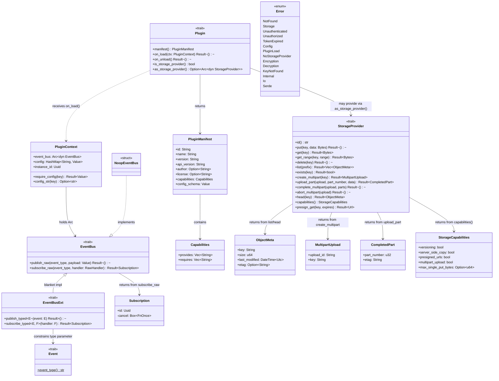
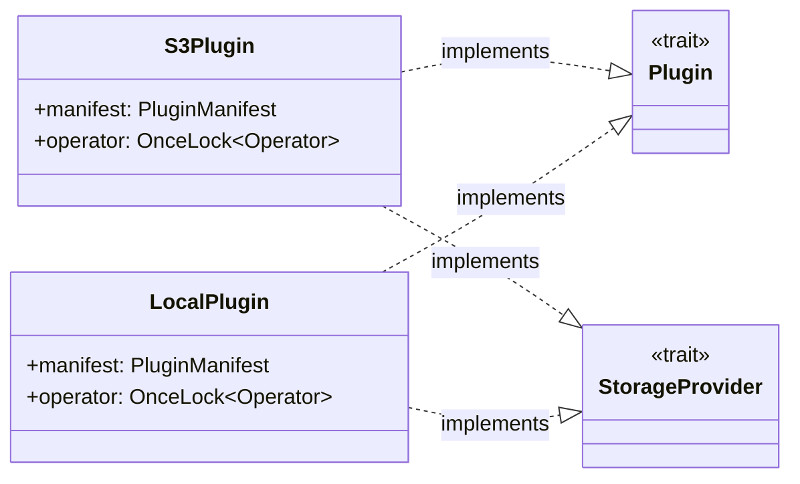

# Core Traits

> Last synced: 2026-05-11

Class diagram for `packages/core` — the plugin API contracts.

## Trait & Type Relationships

```mermaid
classDiagram
    direction TB

    class Plugin {
        <<trait>>
        +manifest() PluginManifest
        +on_load(ctx: PluginContext) Result~()~
        +on_unload() Result~()~
        +is_storage_provider() bool
        +as_storage_provider() Option~Arc~dyn StorageProvider~~
    }

    class StorageProvider {
        <<trait>>
        +id() str
        +put(key, data: Bytes) Result~()~
        +get(key) Result~Bytes~
        +get_range(key, range) Result~Bytes~
        +delete(key) Result~()~
        +list(prefix) Result~Vec~ObjectMeta~~
        +exists(key) Result~bool~
        +create_multipart(key) Result~MultipartUpload~
        +upload_part(upload, part_number, data) Result~CompletedPart~
        +complete_multipart(upload, parts) Result~()~
        +abort_multipart(upload) Result~()~
        +head(key) Result~ObjectMeta~
        +capabilities() StorageCapabilities
        +presign_get(key, expires) Result~Url~
    }

    class EventBus {
        <<trait>>
        +publish_raw(event_type, payload: Value) Result~()~
        +subscribe_raw(event_type, handler: RawHandler) Result~Subscription~
    }

    class EventBusExt {
        <<trait>>
        +publish_typed~E~(event: E) Result~()~
        +subscribe_typed~E, F~(handler: F) Result~Subscription~
    }

    class Event {
        <<trait>>
        +event_type() str$
    }

    class PluginManifest {
        +id: String
        +name: String
        +version: String
        +api_version: String
        +author: Option~String~
        +license: Option~String~
        +capabilities: Capabilities
        +config_schema: Value
    }

    class Capabilities {
        +provides: Vec~String~
        +requires: Vec~String~
    }

    class PluginContext {
        +event_bus: Arc~dyn EventBus~
        +config: HashMap~String, Value~
        +instance_id: Uuid
        +require_config(key) Result~Value~
        +config_str(key) Option~str~
    }

    class ObjectMeta {
        +key: String
        +size: u64
        +last_modified: DateTime~Utc~
        +etag: Option~String~
    }

    class MultipartUpload {
        +upload_id: String
        +key: String
    }

    class CompletedPart {
        +part_number: u32
        +etag: String
    }

    class StorageCapabilities {
        +versioning: bool
        +server_side_copy: bool
        +presigned_urls: bool
        +multipart_upload: bool
        +max_single_put_bytes: Option~u64~
    }

    class Subscription {
        +id: Uuid
        -cancel: Box~FnOnce~
    }

    class NoopEventBus {
        <<struct>>
    }

    class Error {
        <<enum>>
        NotFound
        Storage
        Unauthenticated
        Unauthorized
        TokenExpired
        Config
        PluginLoad
        NoStorageProvider
        Encryption
        Decryption
        KeyNotFound
        Internal
        Io
        Serde
    }

    Plugin --> PluginManifest : returns
    Plugin --> StorageProvider : may provide via as_storage_provider()
    PluginManifest --> Capabilities : contains
    Plugin ..> PluginContext : receives on_load()
    PluginContext --> EventBus : holds Arc

    StorageProvider --> ObjectMeta : returns from list/head
    StorageProvider --> MultipartUpload : returns from create_multipart
    StorageProvider --> CompletedPart : returns from upload_part
    StorageProvider --> StorageCapabilities : returns from capabilities()

    EventBus <|-- EventBusExt : blanket impl
    EventBus --> Subscription : returns from subscribe_raw
    EventBusExt --> Event : constrains type parameter
    NoopEventBus ..|> EventBus : implements
```

## Implementors

```mermaid
classDiagram
    direction LR

    class Plugin {
        <<trait>>
    }
    class StorageProvider {
        <<trait>>
    }

    class S3Plugin {
        +manifest: PluginManifest
        +operator: OnceLock~Operator~
    }
    class LocalPlugin {
        +manifest: PluginManifest
        +operator: OnceLock~Operator~
    }

    S3Plugin ..|> Plugin : implements
    S3Plugin ..|> StorageProvider : implements
    LocalPlugin ..|> Plugin : implements
    LocalPlugin ..|> StorageProvider : implements
```
