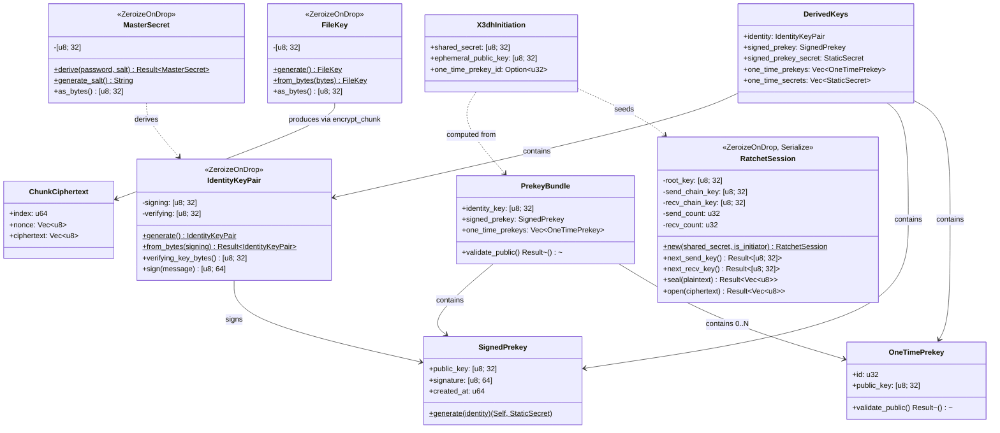
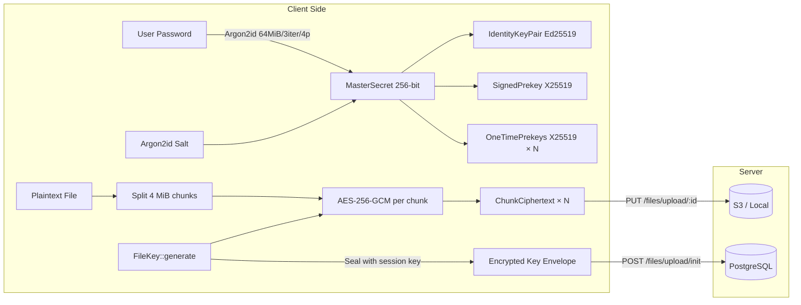
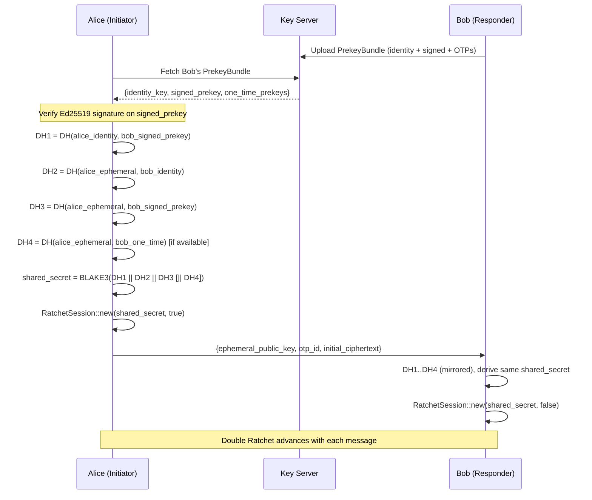

# Crypto Types

> Last synced: 2026-05-11

Class diagram and data flow for `packages/crypto`.

## Key Hierarchy & Types

## Encryption Pipeline

## X3DH Key Agreement Flow

## Domain Separation Constants

| Constant | Value | Used For |
|----------|-------|----------|
| `X3DH` | `"freebox x3dh v1"` | X3DH KDF |
| `RATCHET_ROOT` | `"freebox ratchet root v1"` | Root key derivation |
| `RATCHET_SEND` | `"freebox ratchet send v1"` | Send chain init |
| `RATCHET_RECV` | `"freebox ratchet recv v1"` | Recv chain init |
| `MSG_KEY` | `"freebox msg key v1"` | Per-message key |
| `CHAIN_ADVANCE` | `"freebox chain advance v1"` | Chain ratchet step |
