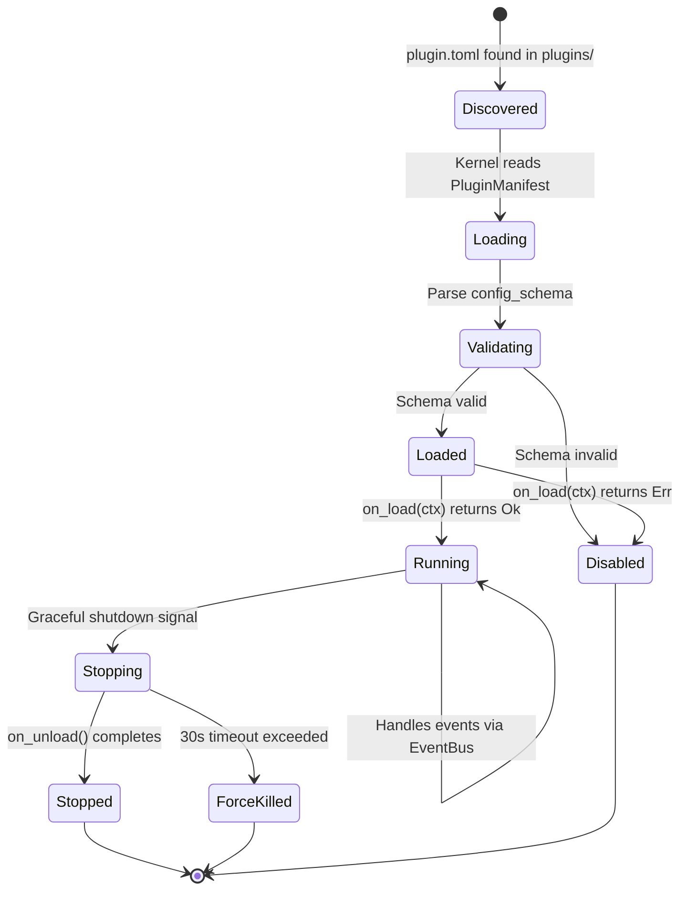
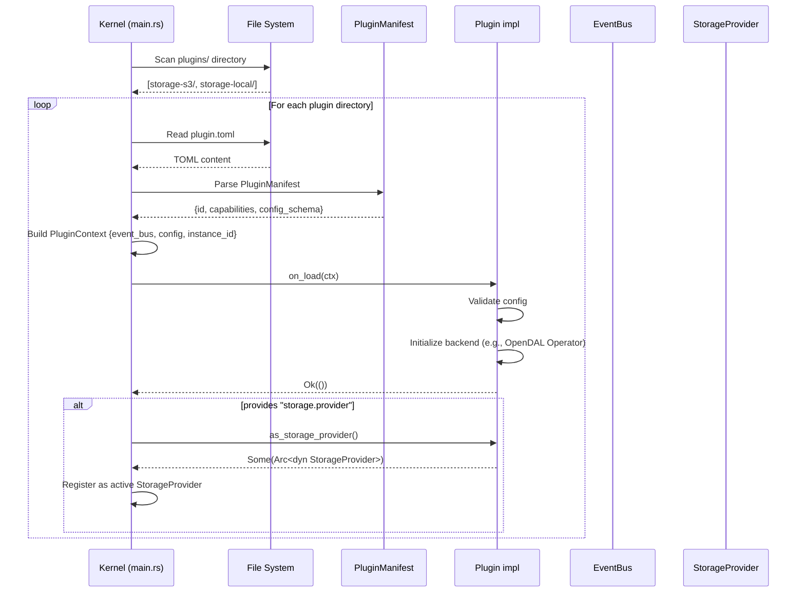
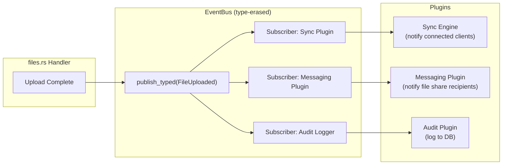
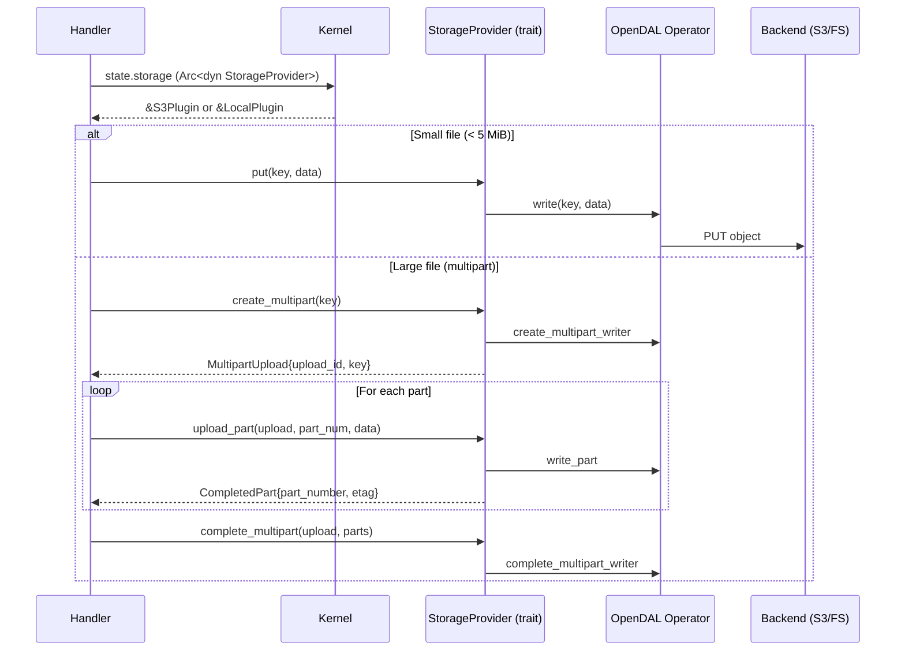

# Plugin Lifecycle

> Last synced: 2026-05-11

Plugin discovery, loading, event flow, and storage call patterns.

## Plugin Lifecycle State Machine



## Plugin Discovery & Bootstrap



## Event Flow Between Plugins



## Storage Provider Call Pattern



## Plugin Manifest Example

```toml
# plugins/storage-s3/plugin.toml
[plugin]
id          = "storage-s3"
name        = "Amazon S3 Storage"
version     = "1.0.0"
api_version = "^1.0"
author      = "FreeBox Team"
license     = "Apache-2.0"

[plugin.capabilities]
provides = ["storage.provider"]
requires = []
```
