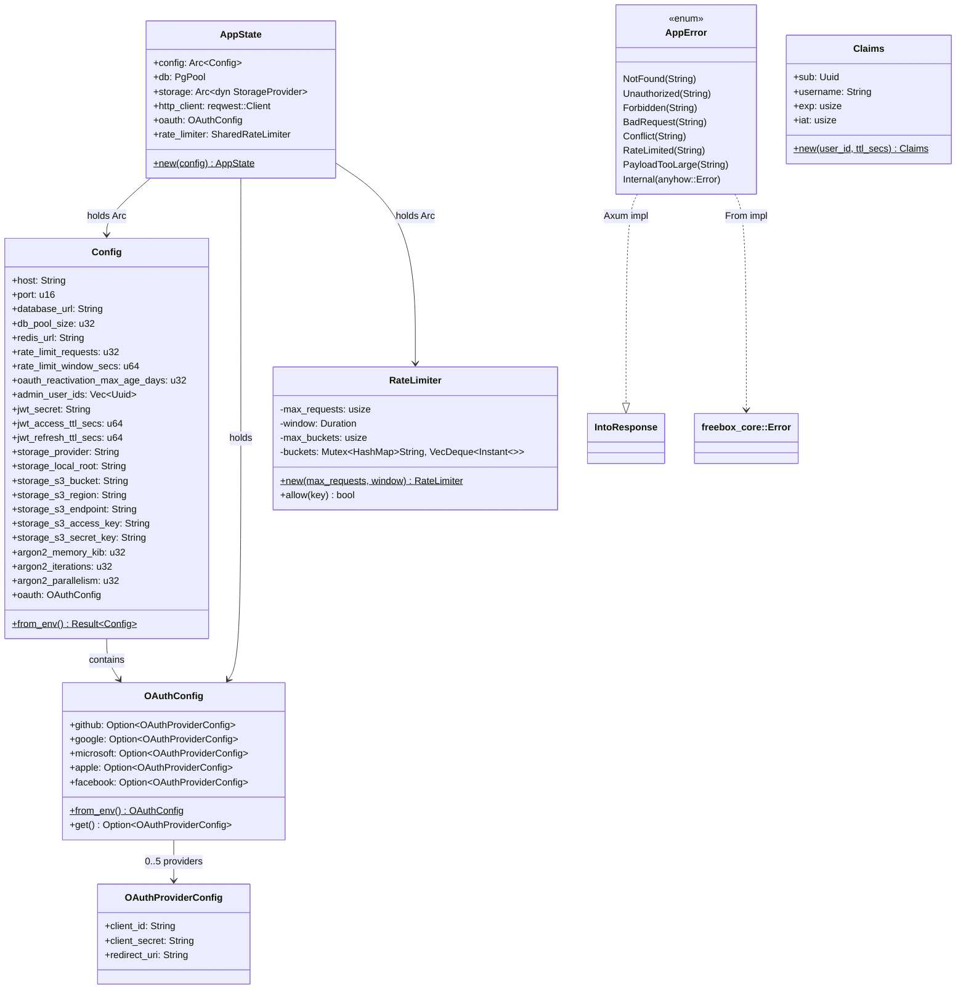

# Server API

> Last synced: 2026-05-11

Class diagram for `apps/server` — state, config, error, and route assembly.

## AppState & Dependencies



## Route Assembly (api/mod.rs)

```mermaid
flowchart TB
    subgraph Middleware Stack
        RID[SetRequestIdLayer<br/>X-Request-Id]
        TRACE[TraceLayer<br/>structured access logs]
        COMP[CompressionLayer<br/>Gzip / Brotli]
        CORS[CorsLayer]
        RL[RateLimiter middleware]
    end

    subgraph Public Routes
        HEALTH["GET /health"]
        REG["POST /auth/register"]
        LOGIN["POST /auth/login"]
        REFRESH["POST /auth/refresh"]
        SALT["GET /auth/salt/:username"]
        OAUTH_CFG["GET /auth/oauth/configured"]
        OAUTH_INIT["GET /auth/oauth/:provider"]
        OAUTH_CB["GET /auth/oauth/:provider/callback"]
        DS["GET /storage/datasources"]
    end

    subgraph Auth Middleware
        AUTH["require_auth<br/>JWT validation → Claims"]
    end

    subgraph Authenticated Routes
        LOGOUT["POST /auth/logout"]
        PROVIDERS["GET /auth/providers"]
        AUDIT["GET /auth/audit-events"]
        ADMIN_AUDIT["GET /admin/audit-events"]
        LINK["POST /auth/oauth/:provider/link"]
        UNLINK["DELETE /auth/oauth/:provider/unlink"]
        KEYS_GET["GET /keys/:user_id"]
        KEYS_OTP["POST /keys/one-time"]
        UP_INIT["POST /files/upload/init"]
        UP_CHUNK["PUT /files/upload/:upload_id"]
        UP_DONE["POST /files/upload/:id/complete"]
        LS_FILES["GET /files"]
        LS_TRASH["GET /files/trash"]
        GET_FILE["GET /files/:file_id"]
        RENAME["PATCH /files/:file_id"]
        DEL_FILE["DELETE /files/:file_id"]
        DL_CHUNK["GET /files/:file_id/chunk/:n"]
        RESTORE["POST /files/:file_id/restore"]
        BUCKETS_LS["GET /storage/buckets"]
        BUCKETS_CR["POST /storage/buckets"]
    end

    RID --> TRACE --> COMP --> CORS --> RL

    RL --> Public Routes
    RL --> AUTH --> Authenticated Routes
```
