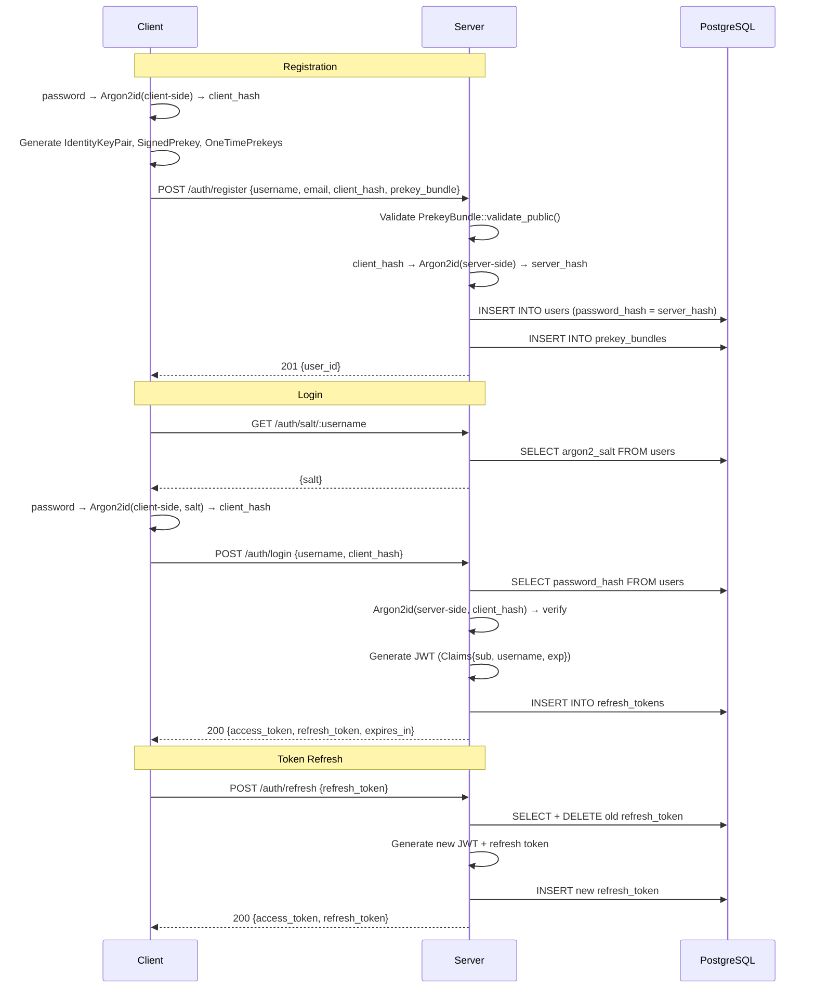
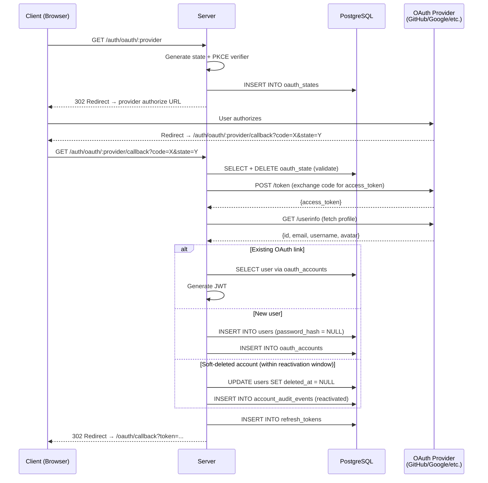
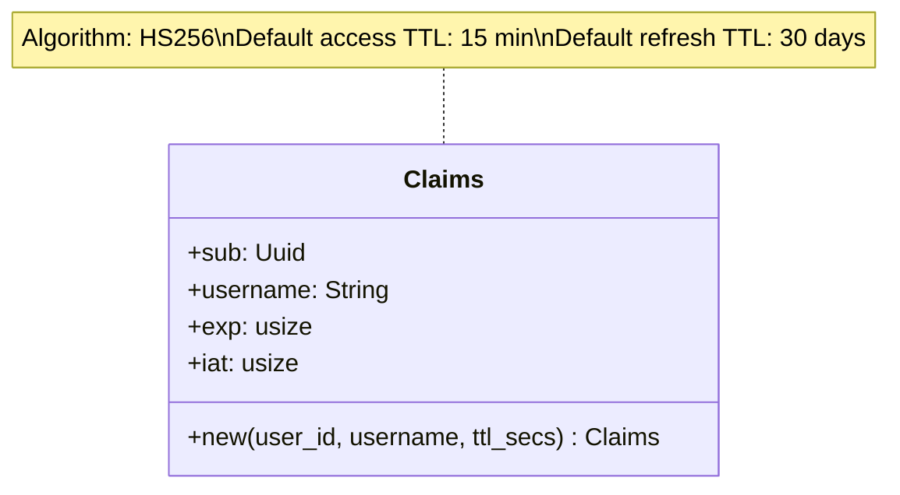

# Server Auth Flow

> Last synced: 2026-05-11

Authentication flow for `apps/server/src/api/auth.rs` and `oauth.rs`.

## Password Auth Flow

```mermaid
sequenceDiagram
    participant C as Client
    participant SRV as Server
    participant DB as PostgreSQL

    Note over C,SRV: Registration
    C->>C: password → Argon2id(client-side) → client_hash
    C->>C: Generate IdentityKeyPair, SignedPrekey, OneTimePrekeys
    C->>SRV: POST /auth/register {username, email, client_hash, prekey_bundle}
    SRV->>SRV: Validate PrekeyBundle::validate_public()
    SRV->>SRV: client_hash → Argon2id(server-side) → server_hash
    SRV->>DB: INSERT INTO users (password_hash = server_hash)
    SRV->>DB: INSERT INTO prekey_bundles
    SRV-->>C: 201 {user_id}

    Note over C,SRV: Login
    C->>SRV: GET /auth/salt/:username
    SRV->>DB: SELECT argon2_salt FROM users
    SRV-->>C: {salt}
    C->>C: password → Argon2id(client-side, salt) → client_hash
    C->>SRV: POST /auth/login {username, client_hash}
    SRV->>DB: SELECT password_hash FROM users
    SRV->>SRV: Argon2id(server-side, client_hash) → verify
    SRV->>SRV: Generate JWT (Claims{sub, username, exp})
    SRV->>DB: INSERT INTO refresh_tokens
    SRV-->>C: 200 {access_token, refresh_token, expires_in}

    Note over C,SRV: Token Refresh
    C->>SRV: POST /auth/refresh {refresh_token}
    SRV->>DB: SELECT + DELETE old refresh_token
    SRV->>SRV: Generate new JWT + refresh token
    SRV->>DB: INSERT new refresh_token
    SRV-->>C: 200 {access_token, refresh_token}
```

## OAuth2 Flow

```mermaid
sequenceDiagram
    participant C as Client (Browser)
    participant SRV as Server
    participant DB as PostgreSQL
    participant OP as OAuth Provider<br/>(GitHub/Google/etc.)

    C->>SRV: GET /auth/oauth/:provider
    SRV->>SRV: Generate state + PKCE verifier
    SRV->>DB: INSERT INTO oauth_states
    SRV-->>C: 302 Redirect → provider authorize URL

    C->>OP: User authorizes
    OP-->>C: Redirect → /auth/oauth/:provider/callback?code=X&state=Y

    C->>SRV: GET /auth/oauth/:provider/callback?code=X&state=Y
    SRV->>DB: SELECT + DELETE oauth_state (validate)
    SRV->>OP: POST /token (exchange code for access_token)
    OP-->>SRV: {access_token}
    SRV->>OP: GET /userinfo (fetch profile)
    OP-->>SRV: {id, email, username, avatar}

    alt Existing OAuth link
        SRV->>DB: SELECT user via oauth_accounts
        SRV->>SRV: Generate JWT
    else New user
        SRV->>DB: INSERT INTO users (password_hash = NULL)
        SRV->>DB: INSERT INTO oauth_accounts
    else Soft-deleted account (within reactivation window)
        SRV->>DB: UPDATE users SET deleted_at = NULL
        SRV->>DB: INSERT INTO account_audit_events (reactivated)
    end

    SRV->>DB: INSERT INTO refresh_tokens
    SRV-->>C: 302 Redirect → /oauth/callback?token=...
```

## JWT Claims Structure

```mermaid
classDiagram
    class Claims {
        +sub: Uuid
        +username: String
        +exp: usize
        +iat: usize
        +new(user_id, username, ttl_secs) Claims
    }

    note for Claims "Algorithm: HS256\nDefault access TTL: 15 min\nDefault refresh TTL: 30 days"
```
