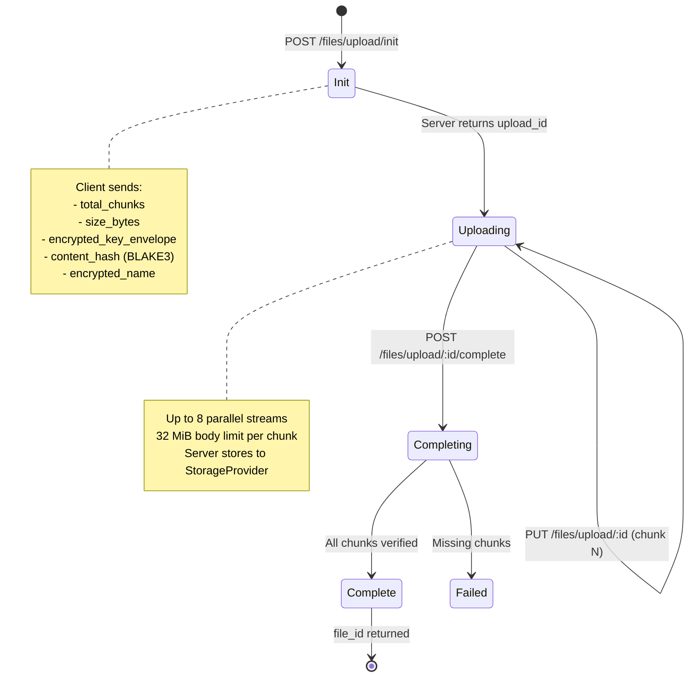
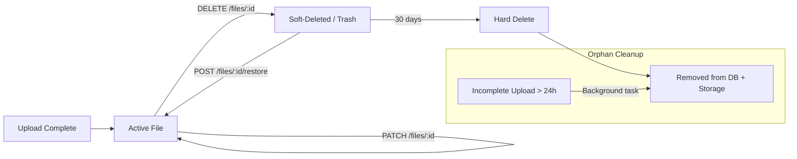
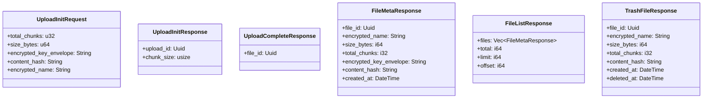
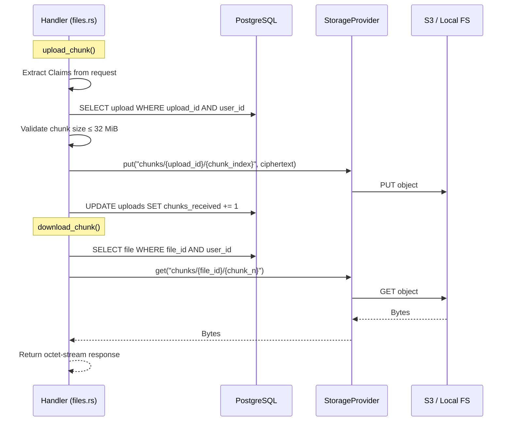

# Server Files Module

> Last synced: 2026-05-11

Data flow and types for `apps/server/src/api/files.rs` — chunked upload/download.

## Upload Protocol (Three-Phase)

## File Lifecycle

## Request/Response Types

## Handler → Storage Call Chain

