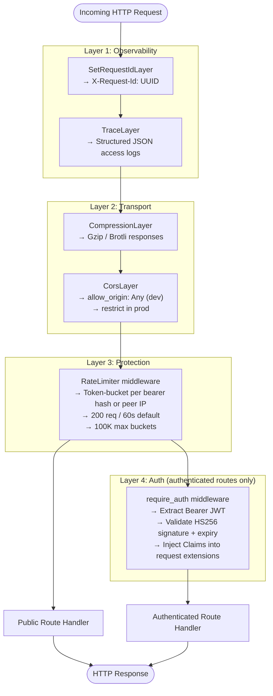
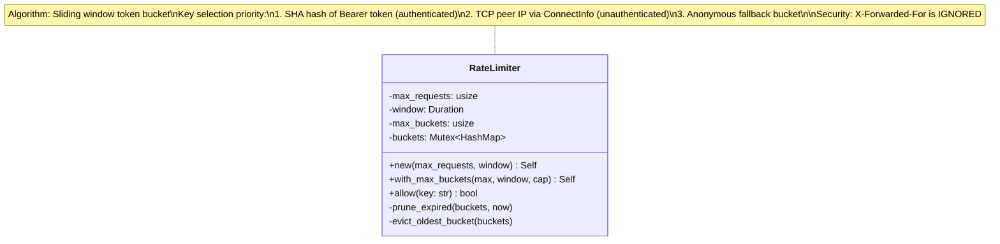

# Server Middleware Stack

> Last synced: 2026-05-11

Middleware layers in `apps/server` — applied outermost-first on every request.

## Middleware Pipeline

## Rate Limiter Design

## Security Properties

| Layer | What it does | Why |
|-------|-------------|-----|
| `SetRequestIdLayer` | Adds `X-Request-Id: UUID` | Log correlation across services |
| `TraceLayer` | JSON-formatted access logs | Observability (Loki, Datadog) |
| `CompressionLayer` | Gzip/Brotli response body | Bandwidth reduction |
| `CorsLayer` | Cross-origin access control | Browser security boundary |
| `RateLimiter` | Per-token/IP request throttling | DoS protection |
| `DefaultBodyLimit` | 32 MiB max on upload route | Memory exhaustion prevention |
| `require_auth` | JWT validation + Claims injection | Authentication |
| `ConnectInfo<SocketAddr>` | TCP peer IP (not headers) | Prevent IP spoofing |
