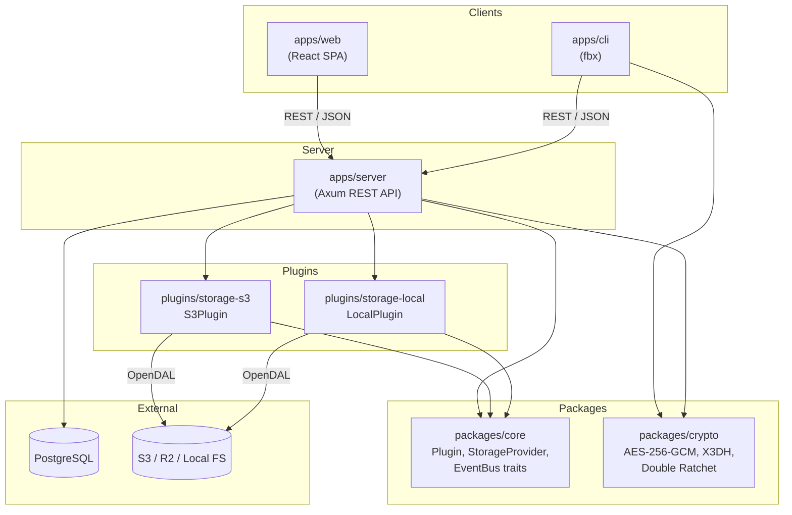
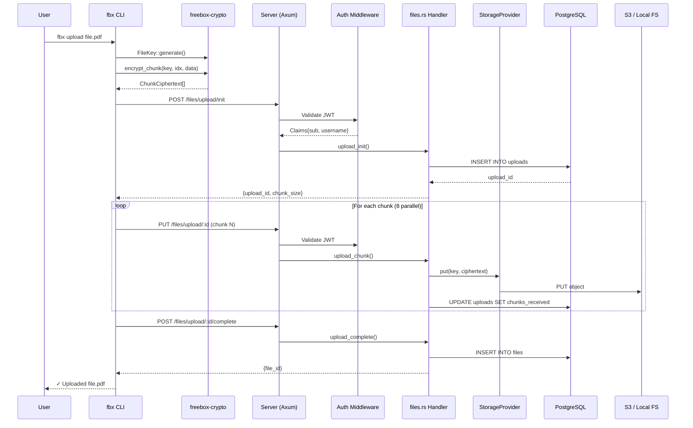
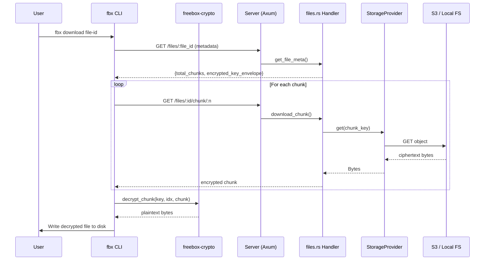

# System Overview

> Last synced: 2026-05-11

High-level crate dependency graph and data flow for the FreeBox platform.

## Crate Dependency Graph

## Data Flow: File Upload (End-to-End)

## Data Flow: File Download

## Module Map

| Crate | Key Exports | Depends On |
|-------|-------------|------------|
| `freebox-core` | `Plugin`, `StorageProvider`, `EventBus`, `Error` | (none — leaf crate) |
| `freebox-crypto` | `FileKey`, `encrypt_chunk`, `decrypt_chunk`, `x3dh_initiate`, `RatchetSession` | (none — leaf crate) |
| `freebox-server` | `AppState`, `Config`, `AppError`, `RateLimiter`, `Claims` | `freebox-core`, `freebox-crypto`, `storage-s3`, `storage-local` |
| `freebox-cli` | `Cli`, `Commands`, `Session`, `CliConfig` | `freebox-crypto` |
| `storage-s3` | `S3Plugin`, `BucketInfo`, `create_bucket`, `list_buckets` | `freebox-core` |
| `storage-local` | `LocalPlugin` | `freebox-core` |
| `apps/web` | React SPA (pages, stores, API client) | (REST API only) |
