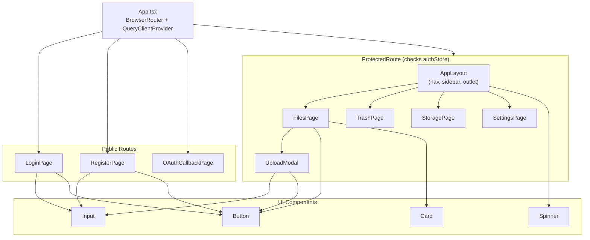
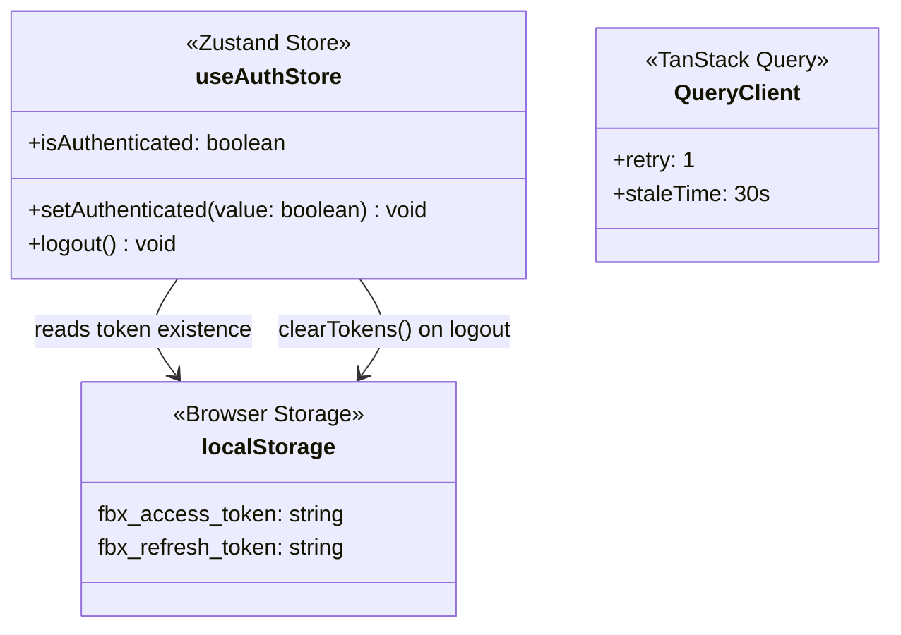
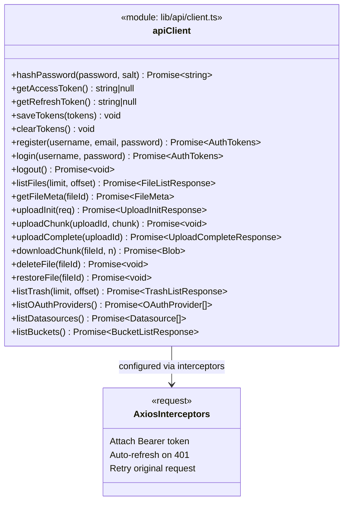
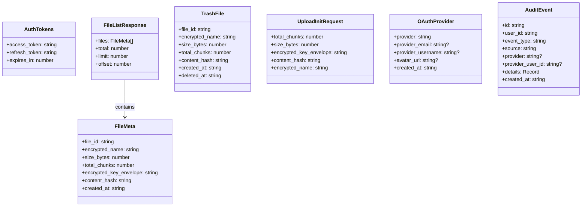

# Web Frontend Components

> Last synced: 2026-05-11

Component tree, stores, and API client for `apps/web` (React + TypeScript + Vite).

## Component Tree

## State Management

## API Client Architecture

## TypeScript Types (mirror server DTOs)

## File Structure

| File | Role |
|------|------|
| `App.tsx` | Root component, routing, QueryClient setup |
| `components/ProtectedRoute.tsx` | Auth guard (redirects to /login) |
| `components/AppLayout.tsx` | Shell layout (nav + content outlet) |
| `components/ui/Button.tsx` | Reusable button component |
| `components/ui/Card.tsx` | Card container |
| `components/ui/Input.tsx` | Form input |
| `components/ui/Spinner.tsx` | Loading spinner |
| `lib/api/client.ts` | Axios-based API client with auto-refresh |
| `lib/api/types.ts` | TypeScript interfaces matching server DTOs |
| `lib/api/index.ts` | Re-exports |
| `stores/authStore.ts` | Zustand auth state |
| `pages/FilesPage.tsx` | File list + upload |
| `pages/TrashPage.tsx` | Trash (soft-deleted files) |
| `pages/StoragePage.tsx` | Storage/datasource management |
| `pages/SettingsPage.tsx` | User settings, OAuth links |
| `pages/LoginPage.tsx` | Login form |
| `pages/RegisterPage.tsx` | Registration form |
| `pages/OAuthCallbackPage.tsx` | OAuth redirect handler |
| `pages/UploadModal.tsx` | Upload dialog |
